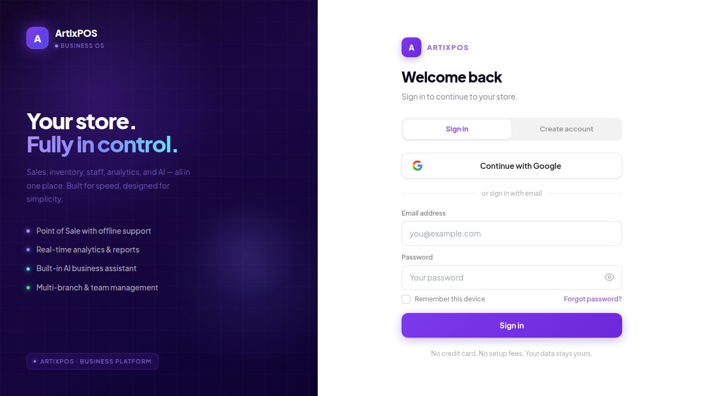

<div align="center">

<a href="#"></a>

<br /><br />


[](https://github.com/ArtixxKrieger/ArtixPOS/actions/workflows/ci.yml)


<br /><br />



</div>

<br />

## What is ArtixPOS?

ArtixPOS is a full-stack POS and business management system built for Filipino stores, restaurants, salons, clinics, pharmacies, hotels, and pretty much any business that needs more than just a cash register.

The goal was simple: one app that handles everything, works without internet, and actually makes sense to use day to day. No more jumping between a POS, a separate inventory tool, a spreadsheet for payroll, and another app for BIR reports.

> Works on the web, installable as a PWA, and wraps into native Android and iOS via Capacitor.

<br />

<table>
  <tr>
    <td align="center" width="200">
      <br />⚡<br />
      <b>Fast</b><br />
      <sub>Sub-50ms responses with two-tier caching</sub>
      <br /><br />
    </td>
    <td align="center" width="200">
      <br />📶<br />
      <b>Offline</b><br />
      <sub>Sell without internet, sync when you're back</sub>
      <br /><br />
    </td>
    <td align="center" width="200">
      <br />🏢<br />
      <b>Multi-Branch</b><br />
      <sub>All your locations under one account</sub>
      <br /><br />
    </td>
    <td align="center" width="200">
      <br />🇵🇭<br />
      <b>BIR Ready</b><br />
      <sub>X/Z-Reports, e-Journal, OR Numbers, VAT</sub>
      <br /><br />
    </td>
  </tr>
</table>

<br />

## Features

### 🛒 Point of Sale
- Touch-friendly register with barcode scanning built in
- Products support variants, sizes, modifiers, and add-ons
- Accepts cash, card, GCash, and Maya
- Auto-generates WiFi voucher codes on receipts
- Handles dine-in, takeout, and delivery queues
- Goes fully offline and syncs everything back when you reconnect

### 📦 Inventory and Products
- Full product catalog with categories, SKUs, and barcodes
- Stock levels update in real time with low-stock alerts
- Expiry date and batch number tracking for pharmacies and groceries
- Supplier profiles and Purchase Order tracking

### 📊 Analytics and Reports
- Revenue dashboard broken down by day, week, and month
- See your top products, category performance, and hourly traffic
- Shift reports with cash drawer reconciliation built in
- Expense tracking so you can see actual net profit

### 🇵🇭 BIR Compliance

| Feature | What it does |
|---|---|
| X-Reports | Shift-level transaction summary |
| Z-Reports | End-of-day fiscal report |
| e-Journal | Electronic journal you can download |
| VAT Breakdown | VATable, VAT-exempt, and zero-rated sales |
| Form 2550M | Monthly VAT worksheet ready to print |
| OR Sequencing | Official receipt numbers that never repeat |
| SC/PWD Discounts | Senior citizen and PWD exemptions handled automatically |
| Audit Trail | Every voided transaction is logged and tamper-evident |

### 👥 Customers and Loyalty
- Customer profiles with their full purchase history
- Loyalty points with birthday bonuses and referral rewards
- Digital stamp cards (buy 10, get 1 free style)
- Membership and subscription plans
- Promo codes with usage limits, minimum order rules, and expiry

### 🏢 Staff and Payroll
- Staff profiles with role-based access controls
- Time clock for clock-in and clock-out
- Payroll that handles hourly, monthly, and commission-based staff
- Calendar booking system for salons, clinics, and gyms
- Assign specific staff members to transactions

### 🍽️ Industry Modules

<table>
  <tr>
    <th>Module</th>
    <th>Who it's for</th>
    <th>What it does</th>
  </tr>
  <tr>
    <td>🍳 Kitchen Display System</td>
    <td>Restaurants and cafes</td>
    <td>Live order queue screen for kitchen staff</td>
  </tr>
  <tr>
    <td>🪑 Table and Floor Management</td>
    <td>Dine-in restaurants and bars</td>
    <td>Visual floor layout showing table status at a glance</td>
  </tr>
  <tr>
    <td>📅 Appointment Calendar</td>
    <td>Salons, clinics, spas</td>
    <td>Booking system with per-staff scheduling</td>
  </tr>
  <tr>
    <td>🛏️ Room Management</td>
    <td>Hotels and guesthouses</td>
    <td>Track room availability and occupancy</td>
  </tr>
  <tr>
    <td>💊 Expiry Tracking</td>
    <td>Pharmacies and groceries</td>
    <td>Batch numbers, generic names, and expiry alerts</td>
  </tr>
</table>

### 🤖 AI Business Assistant
- Pulls insights from your actual sales data
- Runs on multiple AI providers with automatic failover if one goes down
- Falls back to a local AI model when there's no internet at all
- Floating button keeps it one tap away from any screen

<br />

## Tech Stack

<div align="center">


</div>

<br />

<details>
<summary><b>Full stack breakdown</b></summary>
<br />

| Layer | Tech |
|---|---|
| UI Components | Radix UI, Framer Motion, Lucide Icons |
| Routing | Wouter |
| Data Fetching | TanStack Query v5 |
| Auth | Custom JWT, Passport.js, Google OAuth |
| Offline | Service Worker, IndexedDB, mutation sync queue |
| AI Providers | Groq, Cerebras, Mistral, Ollama (offline fallback) |
| Mobile wrapper | Capacitor (Android + iOS) |
| ORM | Drizzle ORM |

</details>

<br />

## How offline works

The app is a PWA so it installs like a native app and keeps working when the internet drops. Sales get written to IndexedDB on the device, a mutation queue tracks everything that happened while offline, and once connectivity comes back it syncs automatically. Nothing gets lost and nobody has to do anything manually.

```
Sell while offline   →  Saved to device (IndexedDB)
Back online          →  Queue syncs automatically
App won't load?      →  Service Worker serves it from cache
AI goes down?        →  Local model picks up the slack
```

<br />

## License

Copyright 2025 ArtixPOS. All rights reserved.

This repo is up for portfolio and demo purposes only. You can look but you can't copy, fork, or use any of this in your own projects without written permission from the author.

<br />


<div align="center">
  <sub>Built for Filipino businesses 🇵🇭</sub>
</div>
